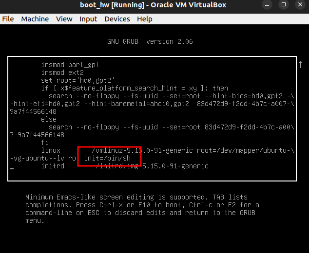
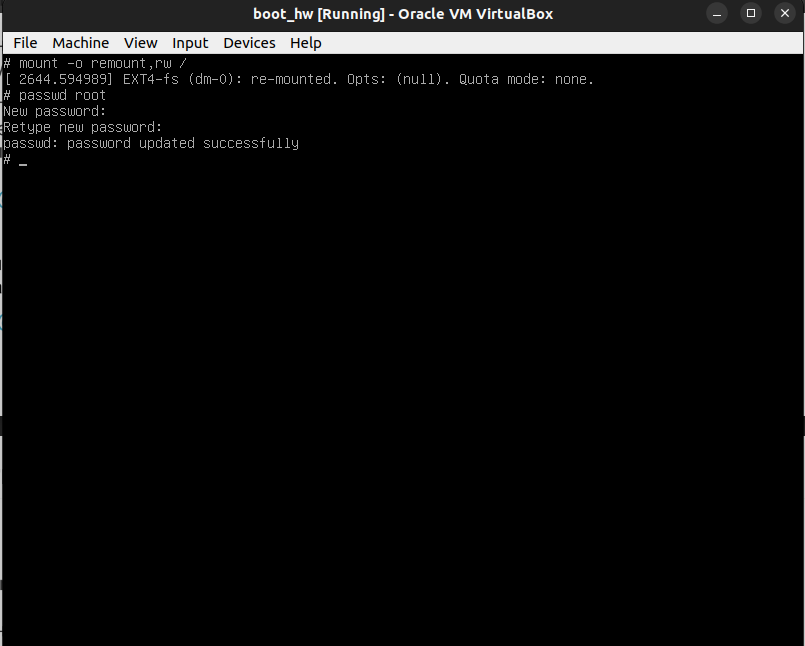
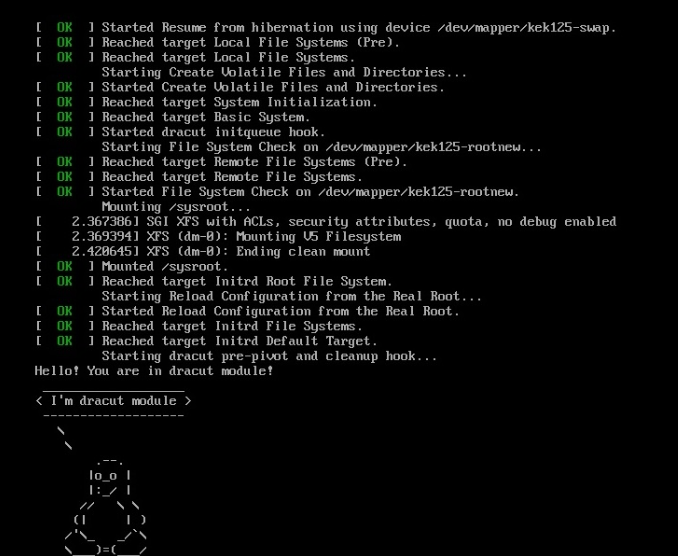

# Задание
1. Попасть в систему без пароля несколькими способами
2. Установить систему с LVM, после чего переименовать VG
3. Добавить модуль в initrd

### Сброс пароля на Ubuntu 22.04

#### Способ №1
1. В меню Grub нажимаем 'e', в строке с Linux прописываем init=/bin/sh, нажимаем ctrl x  ( можно ввести - rw init=/bin/bash  и перейти сразу к шагу 3)


2. Перемонтируем корневую фс рута в режим rw

```mount -o remount,rw /```

3. Сбрасываем пароль root'a

```passwd root```





Способ №2 - данный способ не сработал на ubuntu 22.04.03
1. В меню Grub нажимаем 'e', в строке с Linux прописываем rd.break, нажимаем ctrl x 
2. Перемонтируем корневую фс рута в режим rw

```mount -o remount,rw /```
3. Сбрасываем пароль root'a
```passwd root```

Способ №3 - данный способ не сработал на ubuntu 22.04.03
1. В меню Grub нажимаем 'e', в строке с Linux прописываем rw init=/sysroot/bin/sh, нажимаем ctrl x
2. Сбрасываем пароль root'a
```passwd root```

### Установить систему с LVM, после чего переименовать VG (Centos7)


Проверяем
[root@lvm vagrant]# vgs
  VG         #PV #LV #SN Attr   VSize   VFree
  VolGroup00   1   2   0 wz--n- <38.97g    0 
[root@lvm vagrant]# vgrename VolGroup00 OtusRoot
  Volume group "VolGroup00" successfully renamed to "OtusRoot"

Изменяем fstab
`[root@lvm vagrant]# vi /etc/fstab 
[root@lvm vagrant]# cat /etc/fstab `

```#
# /etc/fstab
# Created by anaconda on Sat May 12 18:50:26 2018
#
# Accessible filesystems, by reference, are maintained under '/dev/disk'
# See man pages fstab(5), findfs(8), mount(8) and/or blkid(8) for more info
#
/dev/mapper/OtusRoot-LogVol00 /                       xfs     defaults        0 0
UUID=570897ca-e759-4c81-90cf-389da6eee4cc /boot                   xfs     defaults        0 0
/dev/mapper/OtusRoot-LogVol01 swap                    swap    defaults        0 0
```
Правим grab
[root@lvm vagrant]#GRUB_TIMEOUT=1
```GRUB_DISTRIBUTOR="$(sed 's, release .*$,,g' /etc/system-release)"
GRUB_DEFAULT=saved
GRUB_DISABLE_SUBMENU=true
GRUB_TERMINAL_OUTPUT="console"
GRUB_CMDLINE_LINUX="no_timer_check console=tty0 console=ttyS0,115200n8 net.ifnames=0 biosdevname=0 elevator=noop crashkernel=auto rd.lvm.lv=OtusRoot/LogVol00 rd.lvm.lv=OtusRoot/LogVol01 rhgb quiet"
GRUB_DISABLE_RECOVERY="true"_
```

Пересоздаем initrd image, чтобы он знал новое название Volume Group
```[root@lvm ~]# mkinitrd -f -v /boot/initramfs-$(uname -r).img $(uname -r)```

После чего перезагружаемся и проверяем:

[root@lvm vagrant]# vgs
```
VG #PV #LV #SN Attr VSize VFree
OtusRoot 1 2 0 wz--n- <38.97g 0``
```

### Добавить свой модуль в initrd

[root@lvm ~]# cd /usr/lib/dracut/modules.d/
[root@lvm modules.d]# mkdir 01logo && cd 01logo

[root@lvm 01logo]# cat logo.sh 
```#!/bin/bash

exec 0<>/dev/console 1<>/dev/console 2<>/dev/console
cat <<'msgend'
Hello! You are in dracut module!
 ___________________
< I'm dracut module >
 -------------------
   \
    \
        .--.
       |o_o |
       |:_/ |
      //   \ \
     (|     | )
    /'\_   _/`\
    \___)=(___/
msgend
sleep 10
echo " continuing...."

```

[root@lvm 01logo]# cat module-setup.sh 
```#!/bin/bash

check() {
    return 0
}

depends() {
    return 0
}

install() {
    inst_hook cleanup 00 "${moddir}/logo.sh"
}
```

##### Лого загрузки




